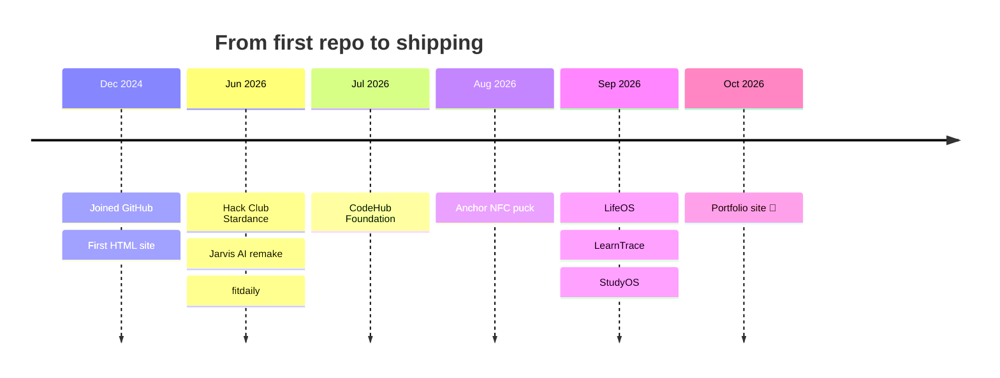

<!-- Header banner: capsule-render (https://github.com/kyechan99/capsule-render) -->


<!-- Typing animation: readme-typing-svg (https://github.com/DenverCoder1/readme-typing-svg) -->
<p align="center">
  <a href="https://github.com/srsuchard">
    
  </a>
</p>

<!-- Badges: shields.io (https://shields.io) -->
<p align="center">
  <a href="https://www.pacificachristian.org/"></a>
  <a href="https://srsuchard.github.io/"></a>
  <a href="https://studyos-neon-phi.vercel.app/"></a>
  <a href="mailto:samuel.suchard@gmail.com"></a>
</p>

---

## 🌊 About Me

```js
const samuel = {
  role: "Student developer",
  school: "Pacifica Christian High School 🐺",
  grade: "9th (Class of 2030)",
  building: "StudyOS",
  makes: ["Apps", "Tools", "3D-printed hardware"],
  stack: ["TypeScript", "Next.js", "React", "Swift", "Python"],
  interests: ["Entrepreneurship", "Surfing", "Sailing", "Cooking", "Taekwondo"],
  funFact: "Second-degree black belt in Taekwondo 🥋",
};
```

- 🔭 Currently building **StudyOS**, a platform that helps students organize classes, assignments, and schoolwork
- 🌱 Currently learning: Git and GitHub workflows, computer science, and entrepreneurship
- 💬 Ask me about: student productivity apps, 3D printing, NFC hardware, or where the waves are good
- ⚡ Fun fact: I've been surfing for 8 years

> *"I build apps, tools, and hardware that solve problems I run into myself."*

---

## 🧰 Tools I Build With

<!-- Skill icons: https://skillicons.dev -->
<p align="center">
  <a href="https://skillicons.dev">
    
  </a>
</p>

---

## 🗺️ My Journey

<!-- GitHub renders Mermaid diagrams natively -->


<details>
<summary><b>🛠️ Things I've Built (click to expand)</b></summary>
<br/>

| Project | What it does |
|---|---|
| 📚 **[StudyOS](https://studyos-neon-phi.vercel.app/)** | Student-focused platform to organize classes, assignments, and schoolwork |
| 🧲 **[Anchor](https://github.com/srsuchard/Anchor)** | Open-source, 3D-printed NFC puck that locks distracting apps until you tap your phone to it again |
| 🧠 **LifeOS** | AI-powered personal operating system for tasks, schedules, projects, and goals |
| 🔍 **LearnTrace** | Evidence-based learning platform that documents the process behind student work |
| 🌐 **[CodeHub Foundation](https://codehub-foundation.vercel.app)** | Free coding education, mentorship, and real-world projects for students |
| 🤖 **[Jarvis](https://github.com/srsuchard/Jarvis)** | My remake of Tony Stark's Jarvis AI |

</details>

---

## 🏄 Off the Clock

| 🌊 Surfing | ⛵ Sailing | 🍳 Cooking | 🥋 Taekwondo |
|:---:|:---:|:---:|:---:|

<!-- Top 5 movies: fill in your picks and remove the comment markers to show this section

### 🎬 My Top 5 Movies

1. **Movie** 🎬
2. **Movie** 🎬
3. **Movie** 🎬
4. **Movie** 🎬
5. **Movie** 🎬

-->

---

## 📊 GitHub Stats

<!-- github-readme-stats & streak-stats are free public services; if a card doesn't load, the service is rate-limited, not broken -->
<p align="center">
  
  
</p>

<p align="center">
  
</p>

## 🐍 Contribution Snake

<!-- Generated daily by .github/workflows/snake.yml using Platane/snk -->
<p align="center">
  <picture>
    <source media="(prefers-color-scheme: dark)" srcset="https://raw.githubusercontent.com/srsuchard/srsuchard/output/github-snake-dark.svg" />
    <source media="(prefers-color-scheme: light)" srcset="https://raw.githubusercontent.com/srsuchard/srsuchard/output/github-snake.svg" />
    
  </picture>
</p>


